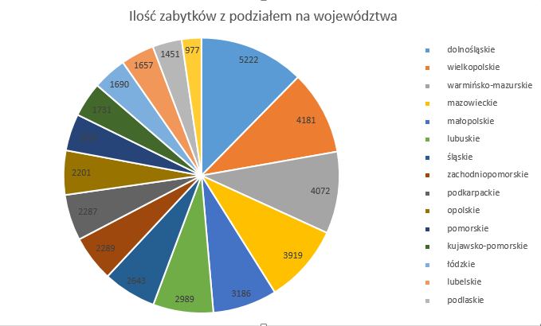

Egzamin, Daniel Jakubek
---------------------------------------------
Wykorzystany sprzet:

|X|Informacje o komputerze                             |
|-----------------------|------------------------------|
| Procesor              | Intel Core i7-3687U 2.60 GHz |
| Ilość rdzeni          | 2 fizyczne, 4 logiczne       |
| Pamięć                | 7,88 GB                      |
| Dysk                  | SSD PLEXTOR PX-128M6M 128 GB |
| System operacyjny     | Linux Ubuntu Gnome 14.04.3   |
| Typ systemu           | 64 - bit                     |
| Model komputera       | Ultrabook DELL XPS 14        |
| MongoDB               | 3.0.7                        |

**Zaimportowana baza [zabytki polski](http://otwartezabytki.pl/strony/pobierz-dane)**

Zliczyłem wszystkie rekordy
```sh
db.zabytki.count()
42346
```

**Wyświetlenie przykładowego rekordu**
------------------------------------------------------------------------------
```sh
db.zabytki.find().limit(1).skip(500)
{
  "_id": ObjectId("56ad2e6eed08f7ed69655275"),
  "id": 10925,
  "nid_id": "601275",
  "identification": "Kamienica",
  "common_name": "",
  "description": "",
  "categories": [
    "mieszkalny"
  ],
  "state": "unchecked",
  "register_number": "A/387/1 z 22.11.1993",
  "dating_of_obj": "190119-03",
  "street": "ul. Cieszkowskiego 16",
  "latitude": 53.1311236,
  "longitude": 18.0062492,
  "tags": [ ],
  "country_code": "PL",
  "fprovince": null,
  "fplace": null,
  "documents_info": null,
  "links_info": null,
  "main_photo": {
    "id": null,
    "relic_id": null,
    "author": null,
    "date_taken": null,
    "alternate_text": null,
    "file": {
      "url": "/assets/fallback/photo_default.png",
      "icon": {
        "url": "/assets/fallback/photo_icon_default.png"
      },
      "mini": {
        "url": "/assets/fallback/photo_mini_default.png"
      },
      "midi": {
        "url": "/assets/fallback/photo_midi_default.png"
      },
      "maxi": {
        "url": "/assets/fallback/photo_maxi_default.png"
      },
      "full": {
        "url": "/assets/fallback/photo_full_default.png"
      }
    },
    "file_full_width": null
  },
  "events": [ ],
  "entries": [ ],
  "links": [ ],
  "documents": [ ],
  "alerts": [ ],
  "descendants": [ ],
  "photos": [ ],
  "place_id": 90115,
  "place_name": "Bydgoszcz",
  "commune_name": "Bydgoszcz",
  "district_name": "Bydgoszcz",
  "voivodeship_name": "kujawsko-pomorskie",
  }
}
```

======================================================================

**Cztery agregacje korzystające z Aggregation Pipeline w JavaScript

-------------------------------------------------------------------------

**1. Wyświetlenie ilości zabytków w poszczególnych województwach**

```sh
db.zabytki.aggregate( {"$group" : {"_id" : "$voivodeship_name", "count" : {"$sum" : 1}}}, {"$sort":{"count":-1}})
```

**Wynik pierwszych trzech**

```sh
{
  "result": [
    {
      "_id": "dolnośląskie",
      "count": 5222
    },
    {
      "_id": "wielkopolskie",
      "count": 4181
    },
    {
      "_id": "warmińsko-mazurskie",
      "count": 4072
    }
  ```
  **Przedstawiony graficznie**
  
  

------------------------------------------------------------------------------------------------------------

2. 
