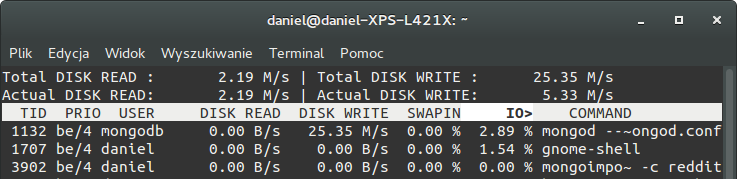
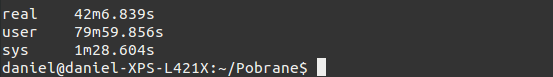
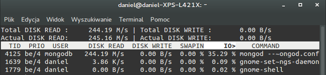
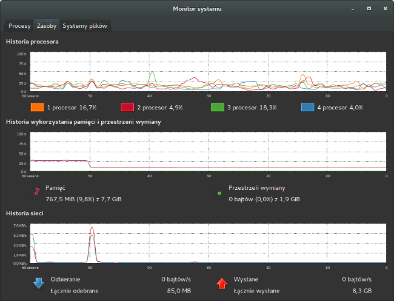
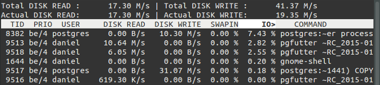
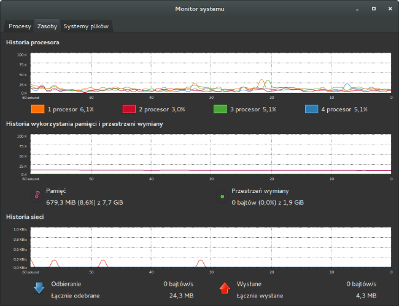
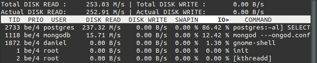
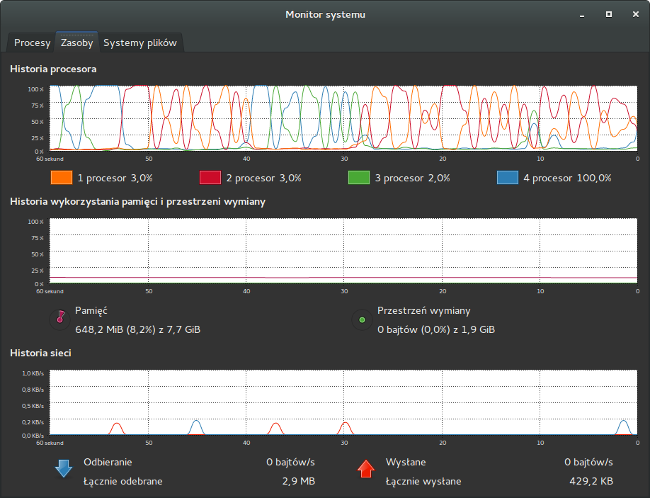

Zaliczenie    Autor: Daniel Jakubek
---------------------------------------------
Wykorzystany sprzet:

|X|Informacje o komputerze                             |
|-----------------------|------------------------------|
| Procesor              | Intel Core i7-3687U 2.60 GHz |
| Ilość rdzeni          | 2 fizyczne, 4 logiczne       |
| Pamięć                | 7,88 GB                      |
| Dysk                  | SSD PLEXTOR PX-128M6M 128 GB |
| System operacyjny     | Linux Ubuntu Gnome 14.04.3   |
| Typ systemu           | 64 - bit                     |
| Model komputera       | Ultrabook DELL XPS 14        |

| Użyte programy        | Wersja                       |
|-----------------------|------------------------------|
| Bunzip2               | 1.0.6                        |
| Mongodb               | 3.0.7                        |
| Postgres              | 9.3.10                       |
| Iotop (program do monitorowania aktywności dyskowej                 | 0.6-1|
| Pgfutter              |


###Zadanie 2a - Mongodb 3.0.7
---------------------------------------------
Rozpakowywanie pliku RC_2015-01.bz2 (**rozmiar : 5,5 GB (5452413560 bajtów)**) wraz z importem do bazy danych
```sh
time bunzip2 -c RC_2015-01.bz2 | mongoimport --drop --host 127.0.0.1 -d test -c reddit
```
Zużycie zasobów (procesora, RAM'u, Sieci, Dysku):


Odczyty/zapisy dysku Iotop



Czas poświęcony na wykonanie importu bazy danych


Rozmiar plików bazy danych po zaimportowaniu 53,7 GB

**Czas:** 43 min 68 sek


###Zadanie 2b - Mongodb
----------------------------------------------------------------
Zliczenie zainportowanych rekordów

```sh
db.reddit.count()
```
**Iość zaimportowanych dokumentów:** 53 851 542

**Czas:** Natychmiast

###Zadanie 2c - Mongodb

**Zliczenie czterech autorów najwyżej ocenionych komentarzy**
```sh
db.reddit.find({},{_id:0, subreddit:1,author:1, score:true}).sort({score:-1}).limit(4)
```

**Wyniki**
```sh
{
  "subreddit": "AskReddit",
  "score": 6597,
  "author": "a1988eli"
}
{
  "subreddit": "tifu",
  "author": "GingaSnapzzz",
  "score": 6448
}
{
  "score": 6105,
  "author": "MAY01337",
  "subreddit": "tifu"
}
{
  "subreddit": "AskReddit",
  "score": 5835,
  "author": "rugtoad"
}
Fetched 4 record(s) in 187727ms
```
**Czas:** 3 minuty 12 sek

**Zliczenie wszystkich komentarzy dotyczących tematu BMW**

```sh
db.reddit.find({subreddit:"BMW"}).count()
```

**Wynik:** 11700 Myślałem ze więcej :)

**Czas:** 2 min 58 sek


Zanalezienie wszystkich komentarzy, których autorzy już nie istnieją
```sh
db.reddit.find({author: "[deleted]"}).count()
```

**Wynik przeszukiwania:**3 917 360 (Całkiem sporo)





We wszystkich przypadkach komputer zachowywał się podobnie i wykazywał większe obciązenie dysku niż pozostałych zasobów. 

**Wniosek:** By przyspieszyć działanie wyszukwania, warto zaopatrzyć się w bardzo szybką macierz dyskową.


##POSTGRES

###Zadanie 2a - Postgres 9.3.10
-----------------------------------------------------------------
Rozpakowałem bazde RC_2015-01 programem bunzip,potem zaimportowałem do Postgresa za pomocą programu [Pgfutter](https://github.com/lukasmartinelli/pgfutter).
```sh
pgfutter --db postgres --user postgres --pw 7890  json RC_2015-01

```
Czas rozpakowywania **15 min**
Czas importu **34 min 46 sek**

Całkowity czas **49 min 46 sek**





###Zadanie 2b - Postgres
-----------------------------------------------------------------
Zliczenie zaimportowanych rekordów

```sh
select count(*) from import.rc_2015_01;

```
**Wynik: 53 851 542**

Czas **4 min 23 sek**

**Ciekawostka:** Pokusiłem się o przekonfigurowanie parametrów bazy danych i jestem mile zaskoczony wynikami. Powyższe zapytanie po zastosowaniu zmian skróciło się do zaledwie **2 min 8 sek !!**. 

Poza szybkością wykonanywanych operacji, zmniejszyło się rzeźbienie po dysku(głównie zapisów i pamięci SWAP) oraz nieznacznie wykorzystanie procesora, system operacyjny lepiej odpowiadał podczs wykonywania zapytania.

Warto zajżeć na stronę [PgTune](http://pgtune.leopard.in.ua/).






###Zadanie 2c - Postgres
-----------------------------------------------------------------

**Zliczenie czterech autorów najwyżej ocenionych komentarzy**

```sh
select data->>'author' AS author,data->>'score' AS score from import.rc_2015_01 order by score desc limit 4;
```
**Czas:** 9 min 3 sek

*Warto pomyśleć nad lepszym zapytaniem :) 


**Zliczenie wszystkich komentarzy dotyczących tematu BMW**

```sh
SELECT count(*) FROM import.rc_2015_01 WHERE data->>'subreddit' like ('BMW');
```

**Wynik:** 11700

**Czas:** 4 min 40 sek



**Zanalezienie wszystkich komentarzy, których autorzy już nie istnieją**

```sh
SELECT count(*) FROM import.rc_2015_01 WHERE data->>'author' like ('[deleted]');
```

**Wynik:** 3917360

**Czas:** 4 min 39 sek

Zachowanie zasobów było identyczne jak powyżej

=================================================================

##PODSUMOWANIE WYDAJNOŚCI BAZ DANYCH
-----------------------------------------------------------------

| Polecenie | MongoDB     | Postgres |
|-----------|-------------|----------|
| Importowanie danych | 43 min 68 sek  |49 min 46 sek |
| Zliczenie zaimportowanych rekordów | Natychmiast  | 2 min 8 sek |
| Zliczenie wszystkich komentarzy dotyczących tematu BMW | 2 min 58 sek | 4 min 40 sek|

Wniosek MongoDB na aktylanym sprzęcie bije o głowe Postgres'a, jest dobry wybór dla BIG DATA :)

=================================================================


###Zadanie 2d - Mongodb - GEOJSON
-----------------------------------------------------------------

Pobrałem [GEOJSON'y](http://otwartezabytki.pl/strony/pobierz-dane) z zabytkami w Polsce **Baza aktualna z 25.01.2016**

Rozpakowałem plik i zaimportowałem JSON'y do mongoDB skryptem powłoki

```sh
ls -1 *.json | sed 's/.json$//' | while read col;
do 
mongoimport --host 127.0.0.1 -d GEOZABYTKI -c zabytki < $col.json;
done
```
**Zaimportowałem 42346 JSON'ów**

Dodałem GEO-Index do kolekcji zabytki

```sh
db.zabytki.ensureIndex({"loc": "2dsphere"})
{  
"createdCollectionAutomatically": false,
 "numIndexesBefore": 1,
 "numIndexesAfter": 2,
 "ok": 1
 }
```

Wyświetlenie przykładowego GEOJSON'a
```sh
daniel-XPS-L421X(mongod-3.0.7) GEOZABYTKI> db.zabytki.find().skip(599).limit(1);

{
  "_id": ObjectId("56ad2e6eed08f7ed696552cf"),
  "id": 11058,
  "nid_id": "601408",
  "identification": "Szkoła Ludowa, ob. Szkolne Schronisko Młodzieżowe",
  "common_name": "",
  "description": "",
  "categories": [
    "sportowy_kulturalny_edukacyjny"
  ],
  "state": "unchecked",
  "register_number": "A/488/1 z 26.05.1997",
  "dating_of_obj": "1896-1898",
  "street": "ul. Sowińskiego 5",
  "latitude": 53.1336059,
  "longitude": 17.997711,
  "tags": [ ],
  "country_code": "PL",
  "fprovince": null,
  "fplace": null,
  "documents_info": null,
  "links_info": null,
  "main_photo": {
    "id": null,
    "relic_id": null,
    "author": null,
    "date_taken": null,
    "alternate_text": null,
    "file": {
      "url": "/assets/fallback/photo_default.png",
      "icon": {
        "url": "/assets/fallback/photo_icon_default.png"
      },
      "mini": {
        "url": "/assets/fallback/photo_mini_default.png"
      },
      "midi": {
        "url": "/assets/fallback/photo_midi_default.png"
      },
      "maxi": {
        "url": "/assets/fallback/photo_maxi_default.png"
      },
      "full": {
        "url": "/assets/fallback/photo_full_default.png"
      }
    },
    "file_full_width": null
  },
  "events": [ ],
  "entries": [ ],
  "links": [ ],
  "documents": [ ],
  "alerts": [ ],
  "descendants": [ ],
  "photos": [ ],
  "place_id": 90115,
  "place_name": "Bydgoszcz",
  "commune_name": "Bydgoszcz",
  "district_name": "Bydgoszcz",
  "voivodeship_name": "kujawsko-pomorskie"
}
```
**Widać że oprócz nazwy zabytku, lokalizacji można z tej bazy dowiedzieć się wielu ciekawych rzeczy, min. województwo i rodzaj zabytku.**


**[Mapka](map.geojson) LineString** przedstawiająca dojaz na studia źródło [geojson.io](http://www.geojson.io)
