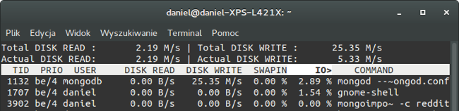

Zaliczenie    Autor: Daniel Jakubek
---------------------------------------------
Wykorzystany sprzet:

|X|Informacje o komputerze                             |
|-----------------------|------------------------------|
| Procesor              | Intel Core i7-3687U 2.60 GHz |
| Ilość rdzeni          | 2 fizyczne, 4 logiczne       |
| Pamięć                | 7,88 GB                      |
| Dysk                  | SSD PLEXTOR PX-128M6M 128 GB |
| System operacyjny     | Linux Ubuntu Gnome 14.04.3   |
| Typ systemu           | 64 - bit                     |
| Model komputera       | Ultrabook DELL XPS 14        |

| Użyte programy        | Wersja                       |
|-----------------------|------------------------------|
| Bunzip2               | 1.0.6                        |
| Mongodb               | 3.0.7                        |
| Postgres              | 9.3.10                       |
| Iotop (program do monitorowania aktywności dyskowej                 | 0.6-1


###Zadanie 2a - Mongodb 3.0.7
---------------------------------------------
Rozpakowywanie pliku RC_2015-01.bz2 (**rozmiar : 5,5 GB (5452413560 bajtów)**) wraz z importem do bazy danych
```sh
time bunzip2 -c RC_2015-01.bz2 | mongoimport --drop --host 127.0.0.1 -d test -c reddit
```
Zużycie zasobów (procesora, RAM'u, Sieci, Dysku):


Odczyty/zapisy dysku Iotop



Czas poświęcony na wykonanie importu bazy danych


Rozmiar plików bazy danych po zaimportowaniu 53,7 GB

**Czas:** 43 min 68 sekund


###Zadanie 2b - Mongodb
----------------------------------------------------------------
Zliczenie zainportowanych rekordów

```sh
db.reddit.count()
```
**Iość zaimportowanych dokumentów:** 53 851 542

**Czas:** Natychmiast

###Zadanie 2c - Mongodb

**Zliczenie czterech autorów najwyżej ocenionych wpisów**
db.reddit.find({},{_id:0, subreddit:1,author:1, score:true}).sort({score:-1}).limit(4)
```sh
{
  "subreddit": "AskReddit",
  "score": 6597,
  "author": "a1988eli"
}
{
  "subreddit": "tifu",
  "author": "GingaSnapzzz",
  "score": 6448
}
{
  "score": 6105,
  "author": "MAY01337",
  "subreddit": "tifu"
}
{
  "subreddit": "AskReddit",
  "score": 5835,
  "author": "rugtoad"
}
Fetched 4 record(s) in 187727ms
```


###Zadanie 2a - Postgres 9.3.10
-----------------------------------------------------------------

###Zadanie 2b - Postgres
----------------------------------------------------------------

